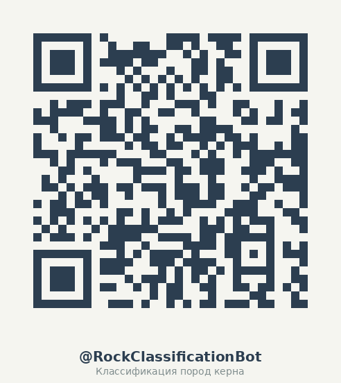

# 🤖 Бот для классификации пород керна



Сканируй QR-код → откроется [@RockClassificationBot](https://t.me/RockClassificationBot)

---

## 📁 1. Датасет

Скачай файлы датасета отсюда: https://disk.yandex.ru/d/YcT3ZkjVFVsa-w (кнопка Скачать Всё)

Распакуй архив и размести фотографии в папках согласно структуре (создай папку dataset и положи распакованные файлы туда, там такая структура и есть):

```text
dataset/
├── train/           # Для обучения
│   ├── limestone/   # Известняк
│   ├── sandstone/   # Песчаник
│   └── shale/       # Сланец
├── val/             # Для валидации
└── test/            # Для теста
```

## 🧠 2. Обучение нейросети

Создай и активируй виртуальное окружение:
```
python -m venv venv
source venv/bin/activate
```

Установи зависимости! 
```
pip install -r requirements.txt
```

Запусти обучение
```
python train.py
```

‼️ Обучение на моём компьютере заняло около 10 минут (на GPU)

Модель сохранится в папку model/rock_classifier.pth.

## 🔑 3. Токен бота
Напиши @BotFather в Telegram.
Выполни команду /newbot.
Скопируй токен (например: 123456789:ABC...).

## 🚀 4. Запуск
```bash
export BOT_TOKEN="твой_токен_здесь"
python bot.py
```

Готово! Отправляй боту фото керна — он определит породу.